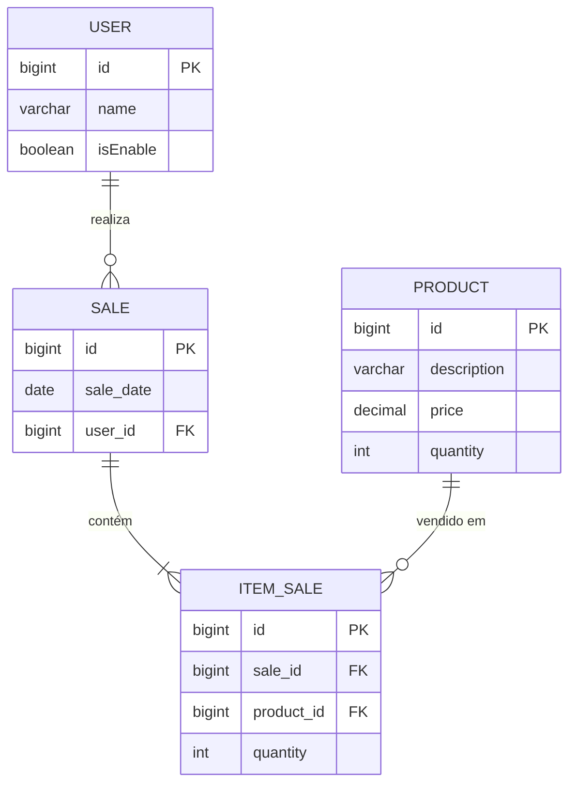

# Ponto de Vendas (PDV) API em Spring Boot

[](https://www.oracle.com/java/)
[](https://spring.io/projects/spring-boot)
[](https://maven.apache.org/)

API de ponto de vendas desenvolvida em Java utilizando Spring Boot Framework. Utiliza H2 (banco em memória) para desenvolvimento e MySQL para produção.

## Sobre o Projeto

O **PDV (Ponto de Vendas)** é uma API REST desenvolvida em Spring Boot para gerenciamento de vendas, produtos e usuários. O sistema permite realizar vendas, controlar estoque de produtos e gerenciar usuários do sistema.

### Funcionalidades

- **Gestão de Produtos**: Cadastro, consulta, atualização e controle de estoque
- **Gestão de Vendas**: Criação de vendas com múltiplos itens
- **Gestão de Usuários**: Cadastro e controle de usuários do sistema
- **Controle de Estoque**: Atualização automática do estoque ao realizar vendas

## Stack Tecnológica

### Core
- **Java 21** - Linguagem de programação
- **Spring Boot 3.2.0** - Framework principal
- **Spring Data JPA** - Persistência de dados
- **Spring Web** - Criação de aplicações web RESTful
- **Bean Validation** - Validação de dados
- **Lombok** - Redução de código boilerplate

### Banco de Dados
- **H2 Database** - Banco em memória para desenvolvimento
- **MySQL** - SGBD para produção

### Ferramentas
- **Apache Maven** - Gerenciamento de dependências e build
- **Apache Tomcat** - Container Web (embarcado no Spring Boot)
- **Postman** - Plataforma para teste de endpoints da API
- **IntelliJ IDEA** - IDE recomendada

## Estrutura do Projeto

```
pdv/
├── src/
│   ├── main/
│   │   ├── java/com/aronalvarenga/pdv/
│   │   │   ├── controller/      # Controladores REST
│   │   │   ├── dto/             # Data Transfer Objects
│   │   │   ├── entity/          # Entidades JPA
│   │   │   ├── repository/      # Repositórios Spring Data JPA
│   │   │   ├── service/         # Lógica de negócio
│   │   │   ├── exceptions/      # Exceções customizadas
│   │   │   └── PdvApplication.java
│   │   └── resources/
│   │       └── application.properties
│   └── test/
└── pom.xml
```

## Diagrama de Banco de Dados



### Relacionamentos

- **User → Sale**: Um usuário pode realizar múltiplas vendas (1:N)
- **Sale → ItemSale**: Uma venda pode conter múltiplos itens (1:N)
- **Product → ItemSale**: Um produto pode aparecer em múltiplos itens de venda (1:N)

## Como Executar

### Pré-requisitos

- **Java 21** instalado
- **Maven** instalado (ou use o wrapper do projeto)

### Executando Localmente

1. **Clone o repositório**
   ```bash
   git clone https://github.com/seu-usuario/Ponto-De-Vendas-PDV-API-Java-Spring-Boot.git
   cd Ponto-De-Vendas-PDV-API-Java-Spring-Boot
   ```

2. **Execute a aplicação**
   ```bash
   mvn spring-boot:run
   ```

3. **Acesse a aplicação**
   - API: `http://localhost:8080`
   - Console H2: `http://localhost:8080/h2-console`

### Acessar o Console H2

Após iniciar a aplicação, o console H2 estará disponível em:

1. Acesse: `http://localhost:8080/h2-console`
2. Preencha os campos com:
   - **JDBC URL**: `jdbc:h2:mem:pdv_db` (⚠️ use exatamente esta URL, sem espaços)
   - **User Name**: `sa`
   - **Password**: (deixe em branco)
3. Clique em "Connect"

**Importante**: Certifique-se de usar exatamente `jdbc:h2:mem:pdv_db` na URL. Se você usar um caminho de arquivo (como `C:/Users/...`), o H2 tentará criar um banco em arquivo e não encontrará o banco em memória.

### Configuração para Produção (MySQL)

Para usar MySQL em produção, configure o `application.properties`:

```properties
spring.datasource.url=jdbc:mysql://localhost:3306/pdv_db
spring.datasource.username=seu_usuario
spring.datasource.password=sua_senha
spring.jpa.hibernate.ddl-auto=update
spring.jpa.show-sql=false
```

## Endpoints da API

### Produtos
- `GET /product` - Lista todos os produtos
- `GET /product/{id}` - Busca produto por ID
- `POST /product` - Cria um novo produto
- `PUT /product/{id}` - Atualiza um produto
- `DELETE /product/{id}` - Remove um produto

### Vendas
- `GET /sale` - Lista todas as vendas
- `GET /sale/{id}` - Busca venda por ID
- `POST /sale` - Cria uma nova venda

### Usuários
- `GET /user` - Lista todos os usuários
- `GET /user/{id}` - Busca usuário por ID
- `POST /user` - Cria um novo usuário
- `PUT /user/{id}` - Atualiza um usuário
- `DELETE /user/{id}` - Remove um usuário

## Testes

### Executando Testes

```bash
mvn test
```

## Contribuindo

Contribuições são bem-vindas! Sinta-se à vontade para abrir issues e pull requests.

## Licença

Este projeto está sob a licença MIT.

## Autor

**Aron Alvarenga**

- GitHub: [@aron-alvarenga](https://github.com/aron-alvarenga)
- LinkedIn: [Aron Alvarenga](https://www.linkedin.com/in/aron-alvarenga)

---

**Nota**: Este projeto utiliza H2 em memória por padrão para facilitar o desenvolvimento. Para produção, configure o MySQL conforme as instruções acima.
