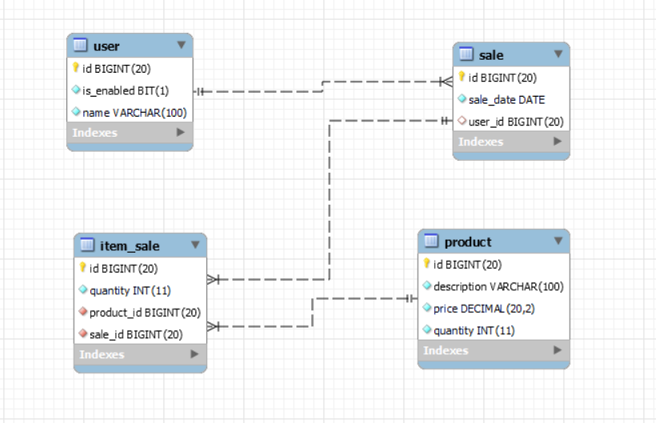

# Ponto de Vendas (PDV) API em Spring Boot
      

API de ponto de vendas desenvolvida em Java utilizando Spring Boot Framework. Utiliza H2 (banco em memória) para desenvolvimento e MySQL para produção.

## Ferramentas e Tecnologias

- Java v. 21 - Linguagem de programação;
- Spring Boot v. 3.2.0 - Framework para desenvolvimento Back-End;
- Lombok - Biblioteca Java para redução de código boilerplate e aumento de produtividade;
- Spring Web - Para criar aplicações web, incluindo RESTful, usando Spring MVC e Apache TomCat como container Web padrão;
- Spring Data JPA - Framework para acesso a dados com mapeamento objeto-relacional (ORM);
- H2 Database - Banco de dados em memória para desenvolvimento;
- MySQL - SGBD para produção;
- Apache Maven - Gerenciamento de dependências e build;
- IntelliJ - IDE;
- Postman - Plataforma para teste de endpoints da API.

## Configuração e Execução

### Pré-requisitos
- Java 21 instalado
- Maven instalado

### Executar o projeto
```bash
mvn spring-boot:run
```

### Acessar o Console H2
Após iniciar a aplicação, o console H2 estará disponível em:
1. Acesse: http://localhost:8080/h2-console
2. Preencha os campos com:
   - **JDBC URL**: `jdbc:h2:mem:pdv_db` (⚠️ use exatamente esta URL, sem espaços)
   - **User Name**: `sa`
   - **Password**: (deixe em branco)
3. Clique em "Connect"

**Importante**: Certifique-se de usar exatamente `jdbc:h2:mem:pdv_db` na URL. Se você usar um caminho de arquivo (como `C:/Users/...`), o H2 tentará criar um banco em arquivo e não encontrará o banco em memória.

## Diagrama de Banco de Dados

<div align="center">
  
</div>